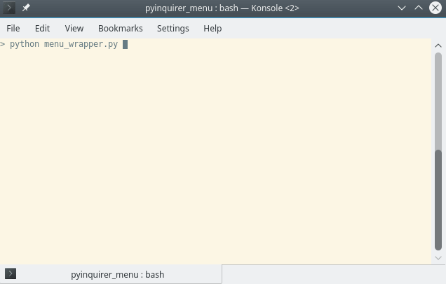

# PyInquirer Menu

## Contents
* [Overview](#overview)
* [Menu](#menu)
* [Menu Item](#menuitem)
* [Example](#example)

## Overview<a name="overview">
Wrapper for PyInquirer allowing easy creation of multi-level menus.

The wrapper consists of two classes, `Menu` and `MenuItem`. A `Menu` is a list of options that can be selected and a `MenuItem` is a selectable item in a `Menu`. `Menu`'s can also be nested.



### Dependencies
The package has the following dependencies:

* PyInquirer (tested with `1.0.3`)

## Menu<a name="menu">
`Menu`'s contain a list of items that a user can select. The items can either be other `Menu`'s or `MenuItem`'s.

`MenuItem`'s can be linked to a `Menu` through its constructor (the `children` argument), or afterwards using the `add_children` method. The `add_children` method automatically sets each of the children's `parent` attribute.

### Methods

#### `__init__(self, text, children=None, parent=None, prompt_text=None, has_back=True, on_show=None)`

* **`text`** [string]: The text that is shown when this `Menu` is a child of another `Menu`.
* **`children`** [list]: A list of children that will be added to the `Menu` (can contain other `Menu` objects as well as `MenuItem` objects). The constructor calls `add_children` internally.
* **`parent`** [`Menu`]: The `Menu`'s parent.
* **`prompt_text`** [string]: The text shown in the prompt for the `Menu`.
* **`has_back`** [bool]: Determines whether a 'Back' option is added to the `Menu`.
* **`on_show`**: [Callable]: Called (with a reference to the menu) just before the menu is shown. `on_show(menu)`.

#### `add_children(self, children)`

The children given to the method are added to the `Menu` and each of the children's `parent` attribute is set to the `Menu`.

* **`children`** [list]: A list of children that will be added to the `Menu`.

A child's parent will be set to this `Menu`'s parent if this `Menu` does not have a back option.

#### `loop(root_menu)`

Static method that shows the root `Menu` and allows traversal of the `Menu`'s. The method returns if the user goes 'Back' from the root `Menu`.

* **`root_menu`** [`Menu`]: The root `Menu` that will be shown first.

## MenuItem<a name="menuitem">
`Menu`'s are linked to `MenuItem`s by setting the `parent` property of the `MenuItem` (through the constructor or afterwards).

### Methods

#### `__init__(self, text, handler, parent=None, additional_questions=None, menu_after=None)`

* **`text`** [string]: Text that is shown in `Menu` for this `MenuItem`.
* **`handler`** [callable]: Function that is called when this `MenuItem` is selected.
* **`parent`** [`Menu`]: This `MenuItem`'s parent `Menu`.
* **`additional_questions`** [list]: List of questions that should be asked after this item is selected.
* **`menu_after`** [`Menu`]: `Menu` to be shown after this `MenuItem` has been handled.

`additional_questions` allows more questions to be asked after a `MenuItem` has been selected. Input and checkbox questions are currently supported. Questions can also be set to only be asked once.

`additional_questions` is a `dict` with the following keys.

* `'type'` [string]: `'input'` or `'checkbox'`. Defaults to `'input'` if key omitted.
* `'msg'` [string]: Text that is displayed when showing the query. Can be omitted for `checkbox` type.
* `'once'` [bool]: Determines if the question will only be asked once. If `True`, the `handler` must have an optional argument for this question and the name of the argument is supplied by the `'name'` key.
* `'name'` [string]: Name of the optional argument in the `handler` method.
* `'choices'` [list]: List of strings that user can pick.
* `'conv'` [callable]: Function to postprocess (convert) the user-supplied value.
* `'default'` [string/callable]: String or callable that will be used as default value to question (the callable will be called with no arguments to obtain the default value).

`handler` is a callable that will be called when the `MenuItem` is selected. The results of additional questions are passed to the `handler` in the order that the questions appear in the list. Additional questions that are set to `'once'` will be passed to the `handler` through an optional parameter, with the name specified by the `'name'` key.

An example of a `MenuItem` and appropriate `handler` is shown below.

```python

def handler(filepath, number, choices, opt_var=None):
	pass

MenuItem('Test',
     handler,
     additional_questions=[
	 {'msg': 'Enter file path.'}, # Note missing 'type' that defaults to 'input'
	 {'msg': 'Enter a number.',
	  'defaut': '15',
	  'conv': int}, # Converts to integer
	 {'type': 'checkbox', # Note missing 'msg'
	  'choices': ['choice1', 'choice2']},
	 {'msg': 'Enter a value.',
	  'once': True,
	  'name': 'opt_var'}
     ])
```

The first time the `MenuItem` is selected, three questions will be asked (and the value of the fourth question passed to `opt_var` of the `handler`). On subsequent calls, the fourth question is not asked and no value is given to `opt_var` of the `handler`.

## Example<a name="example">

The following example shows how a multi-level menu can be constructed in compact form.

```python
def handler(filepath, number, choices, opt_var=None):
	print('')
	print('filepath:\t{}\t\ttype:\t\t{}'.format(filepath, type(filepath)))
	print('number:\t\t{}\t\t\ttype:\t\t{}'.format(number, type(number)))
	print('choices:\t{}\ttype:\t\t{}'.format(choices, type(choices)))
	print('opt_var:\t{}\t\ttype:\t\t{}'.format(opt_var, type(opt_var)))
	print('')

root_menu = Menu('Root')
root_menu.add_children([
	Menu('Top Level 1',
	 children=[
	     MenuItem('Mid Level 1 Item',
		      lambda: print('Mid Level 1 Item called')),
	     MenuItem('Mid Level 2 Item',
		      lambda: print('Mid Level 2 Item called'))
	 ]),

	Menu('Top Level 2',
	 has_back=False,
	 children=[
	     MenuItem('Mid Level 3 Item',
		      lambda: print('Mid Level 3 Item called')),
	     Menu('Mid Level 4 Menu',
		  children=[
		      MenuItem('Bottom Level 1 Item',
			       lambda: print('Bottom Level 1 Item called')),
		      MenuItem('Additional questions test',
			       handler,
			       additional_questions=[
				   {'msg': 'Enter file path.'},
				   {'msg': 'Enter a number.',
				    'default': '15',
				    'conv': int},
				   {'type': 'checkbox',
				    'choices': ['choice1', 'choice2']},
				   {'msg': 'Enter a value.',
				    'once': True,
				    'name': 'opt_var'}
			       ])

		  ])

	 ])
])

Menu.loop(root_menu)
```

